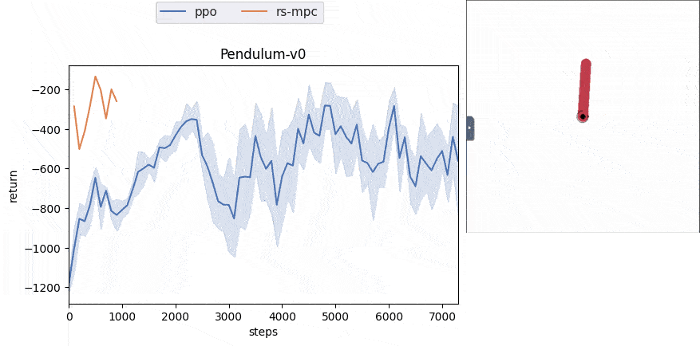
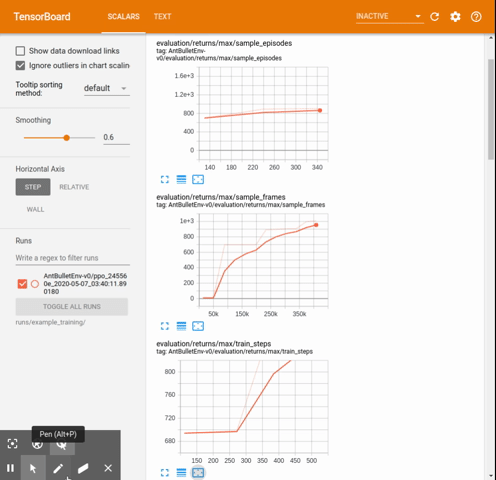

# PyTorch-RL-IL (rlil): A PyTorch Library for Building Reinforcement Learning and Imitation Learning Agents

`rlil` is a library for reinforcement learning (RL) and imitation learning (IL) research. 

**This library is developed from [Autonomous Learning Library (ALL)](https://github.com/cpnota/autonomous-learning-library/tree/master/all).**

Some modules such as `Approximation`, `Agent` and `presets` are almost the same as `ALL`.
For the basic concepts of them, see the original documentation: https://autonomous-learning-library.readthedocs.io/en/stable/. 

Unlike `ALL`, `rlil` uses an distributed sampling method like [rlpyt](https://github.com/astooke/rlpyt) and [machina](https://github.com/DeepX-inc/machina.git), which makes it easy to switch between offline and online learning.
Also, `rlil` utilizes a replay buffer library [cpprb](https://ymd_h.gitlab.io/cpprb/).

## Algorithms

### Online RL

These algorithms are run online and do not require demonstrations.

You can test the algorithms by:

```
python scripts/continuous/online.py [env] [agent] [options]
```

- [x] [`Vanilla Actor Critic (VAC)`](https://papers.nips.cc/paper/1786-actor-critic-algorithms.pdf), [code](rlil/agents/vac.py)
- [x] [`Deep DPG (DDPG)`](https://arxiv.org/abs/1509.02971), [code](rlil/agents/ddpg.py)
- [x] [`Twind Dueling DDPG (TD3)`](https://arxiv.org/abs/1802.09477), [code](rlil/agents/td3.py)
- [x] [`Soft Actor Critic (SAC)`](https://arxiv.org/abs/1801.01290), [code](rlil/agents/sac.py)
- [x] [`Proximal Policy Optimization Algorithms (PPO)`](https://arxiv.org/abs/1707.06347), [code](rlil/agents/ppo.py)
- [ ] [`Trust Region Policy Optimization (TRPO)`](https://arxiv.org/abs/1502.05477)


### Model-based RL

You can test the algorithms by:

```
python scripts/continuous/online.py [env] [agent] [options]
```

- [x] [`Neural Network Dynamics for Model-Based Deep Reinforcement Learning with Model-Free Fine-Tuning`](https://arxiv.org/abs/1708.02596), [code](rlil/agents/rs_mpc.py)



### Learning from demonstrations

The following offline IL and RL algorithms train an agent with a demonstration and do not require any interaction with the environment.

You can test the algorithms by:

```
python scripts/continuous/online.py [env] [agent] [path to the directory which includes transitions.pkl]
```

#### Offline IL

- [x] `Behavioral Cloning (BC)`, [code](rlil/agents/bc.py)
- [x] `VAE Behavioral Cloning (VAE-BC)`, [code](rlil/agents/vae_bc.py)

#### Offline RL

These offline rl implementations should be incorrect and the result doesn't follow the result of the original paper.
Any contributions and suggestions are welcome.

- [x] [`Batch-Constrained Q-learning (BCQ)`](https://arxiv.org/abs/1812.02900), [code](rlil/agents/bcq.py)
- [ ] [`Bootstrapping Error Accumulation Reduction (BEAR)`](https://arxiv.org/abs/1906.00949), [code](rlil/agents/bear.py)
- [x] [`Behavior Regularized Actor Critic (BRAC)`](https://arxiv.org/abs/1911.11361), [code](rlil/agents/brac.py)


#### Online IL

The online IL algorithms train an agent with a demonstration and interactions with the environment.

You can test the algorithms by:

```
python scripts/continuous/online_il.py [env] [agent (e.g. gail)] [base_agent (e.g. ppo)] [path to the directory which includes transitions.pkl]
```

- [x] [`Generative Adversarial Imitation Learning (GAIL)`](https://arxiv.org/abs/1606.03476), [code](rlil/agents/gail.py)
- [x] [`Learning Robust Rewards with Adversarial Inverse Reinforcement Learning (AIRL)`](https://arxiv.org/abs/1710.11248), [code](rlil/agents/airl.py)
- [x] [`Soft Q Imitation Learning (SQIL)`](https://arxiv.org/abs/1905.11108), [code](rlil/memory/sqil_wrapper.py)


### Others

Currently, DDPG, TD3 and SAC can be combined with M-step, PER and Ape-X. To enable them, just pass `n_step`, `prioritized` or `use_apex` argument to the preset. For example,

```
from rlil.presets.continuous import ddpg
ddpg(n_step=5, prioritized=True)
ddpg(apex=True)
```

The implementation of Ape-X is not same as the original paper since `rlil` uses episodic training.
The implemented Ape-X is unstable and sensitive to the mini-batch size. See [this issue](https://github.com/syuntoku14/pytorch-rl-il/issues/4#issue-628178561).

- [x] [`Noisy Networks for Exploration`](https://arxiv.org/abs/1706.10295), [code](rlil/nn/__init__.py)
- [x] [`Prioritized Experience Replay (PER)`](https://arxiv.org/abs/1511.05952), [code](rlil/memory/replay_buffer.py)
- [x] [`Multi-step learning (M-step)`](https://arxiv.org/abs/1710.02298), [code](rlil/memory/replay_buffer.py)
- [x] [`Ape-X`](https://arxiv.org/abs/1803.00933), [code](rlil/samplers/asyncsampler.py)

## Environments

Some popular imitation learning algorithms, like BC and GAIL, assume that the expert demonstrations come from the same MDP. 
This assumption does not hold in many real-life scenarios where discrepancies between the expert and the imitator MDPs are common.
Therefore, rlil has some different dynamics pybullet envs for such different MDP settings.
For example, the following code makes a pybullet ant env with half the length of its front legs.

```
import gym
from rlil.environments import ENVS

gym.make(ENVS["half_front_legs_ant"])
```

See [rlil/environments/\_\_init\_\_.py](rlil/environments/__init__.py) for the available environments.


## Installation

You can install from source:

```
git clone git@github.com:syuntoku14/pytorch-rl-il.git
cd pytorch-rl-il
pip install -e .
```

## Getting Started

Follow the installation instruction above, and then get started in the [scripts](scripts) folder.

### Training

The [scripts/continuous](scripts/continuous) folder includes the training scripts for continuous environment. See the Algorithms section above for instructions on how to run them. 

**Example**:

The following code uses PPO to train an agent for 60 minutes.
The option `--num_workers` allows you to specify the number of workers for distributed sampling.
The `--exp_info` option is used in order to organize the results directory. 
It should include a one-line description of the experiment.

The result will be saved in the directory: `runs/[exp_info]/[env]/[agent with ID]`.

```
cd pytorch-rl-il
python scripts/continuous/online.py ant ppo --train_minutes 60 --num_workers 5 --exp_info example_training
```

You can check the training progress using:
```
tensorboard --logdir runs/[exp_info]
```
and opening your browser to http://localhost:6006.
The tensorboard records not only the learning curve, but also presets' parameters and settings related to the experiment, such as git diffs.



After the training, you can draw the learning curve by `scripts/plot.py`:

```
python scripts/plot.py runs/[exp_info]/[env]/[agent with ID]
```

The figure of the learning curve will be saved as `runs/[exp_info]/[env]/[agent with ID]/result.png`.

Same as `ALL`, you can watch the trained model using:

```
python scripts/continuous/watch_continuous.py runs/[exp_info]/[env]/[agent with ID]
```

### Record trajectory and train with the trajectory

You can run the trained agent and save the trajectory by [scripts/record_trajectory.py](scripts/record_trajectory.py).

```
python scripts/record_trajectory.py runs/[exp_info]/[env]/[agent with ID]
```

Then, `transitions.pkl` file, which is a pickled object generated by [cpprb.ReplayBuffer.get_all_transitions()](https://ymd_h.gitlab.io/cpprb/api/api/cpprb.ReplayBuffer.html), will be saved in `runs/[exp_info]/[env]/[agent with ID]`.

You can train an agent with imitation learning using the `transitions.pkl`.

**Example**:

The following code uses the trained agent in the previous PPO example.

```
# record trajectory
python scripts/record_trajectory.py runs/example_training/AntBulletEnv-v0/[ppo_ID]

# start sqil with sac training
python scripts/online_il.py ant sqil sac runs/example_training/AntBulletEnv-v0/[ppo_ID] --exp_info example_sqil

# plot the result
python scripts/plot.py runs/example_sqil/AntBulletEnv-v0/[sqil-sac_ID]
```
